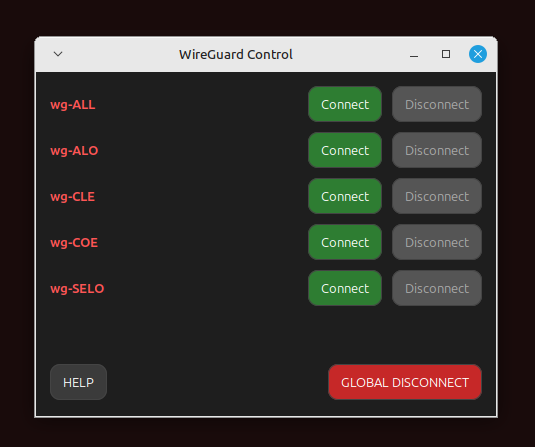

# WireGuard Connection UI

GTK-based multi-connection WireGuard manager 
Version 2.1

FILE LIST: 
wg-ui.pl - The actual program. 
wg-ui-help.txt - The help file

INSTALL & USAGE: Read the wg-ui-help.txt
